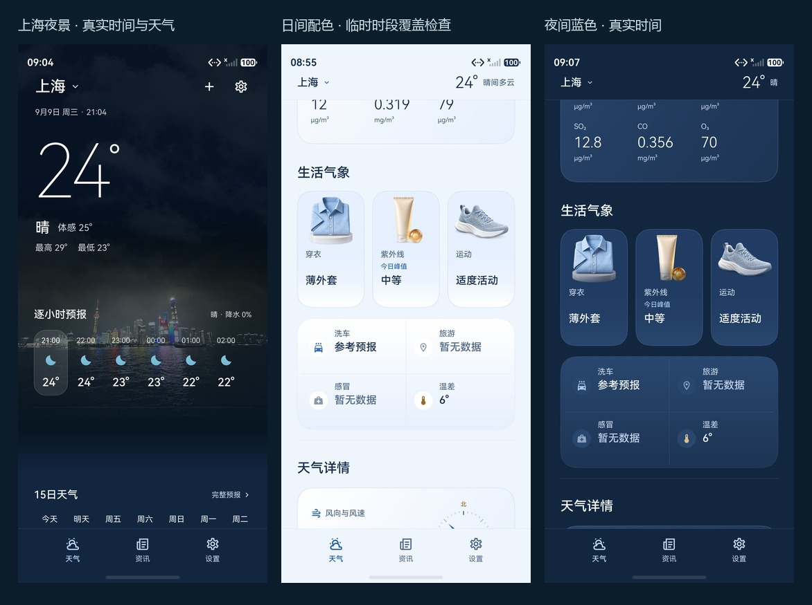

# 蓝白主题试版 · 2026-09-09

本次是已确认布局上的材质换肤，不重做城市场景，不改变天气数据源。
保留生活气象的具象插画、风向罗盘、日照轨迹、完整预报与所有既有页面入口。

## 视觉结果

- 白天：冰蓝页面、白色到浅蓝面板、深蓝文字与图标；保留圆角、轻边界与插画立体感。
- 夜间：低亮度深蓝页面与柔蓝面板，不强行铺满白色；雨、雾、雪继续使用对应色板。
- 首页城市与逐小时区域保持原来的场景色彩，经 64vp 色彩过渡接入数据区。
  深色衬底覆盖整个顶部内容的自然高度，不再依赖固定场景高度来保证白字可读。
- 设置、资讯、城市管理、关于、隐私、预报详情及原生详情面板使用相同表面配色。
  照片上的城市标题仍保留白字。新闻原站 Web 内容不做强制换肤。
- 三张生活插画改用真实透明底 PNG，消除旧绿色底板；鞋面改为冰蓝灰。
  [资源路径与完整生成/编辑提示词](../design/bluewhite-assets-prompts.md)。原图没有删除。

## 城市动效没有被换肤替代

`BreathingBackground.ets`、`WeatherTheme.ets`、城市照片、雨线、玻璃水滴与雪资源均未修改。
UI 表面主题单独映射，不修改传入动态背景的场景主题；未增加动画计时器。
首页继续按当前城市时区、真实时刻和已有天气数据选择昼夜与天气状态。

- [改造前夜间云层实录](../design/bluewhite-before-motion.gif)
- [最终试版夜间云层实录](../design/bluewhite-after-motion.gif)
- 最终实录 18 帧，实际采样跨度 13.765 秒，GIF 保留捕获间隔；不是高帧率录屏或性能测试。
- 本轮现场天气为上海夜间晴/晴间多云，动效观察为慢移云层。雨线、玻璃雨滴与雪的实现
  保留，但没有在本轮现场晴天天气下声称验证了真实降雨或降雪。

## 截图与验证边界

夜间图是模拟器当前真实时刻与在线天气；浅色图是仅将 UI 色板时刻临时提前 8 小时的
原生配色检查，城市场景、系统时间与天气数据未伪造。该临时偏移已删除，最终安装包
恢复 `AtmosphereTokens.forWeather(weatherData, sceneTime)`，不存在强制白天或新的演示入口。
昼夜截图间天气与观测时刻可能变化，不能拿数值差异当成主题造成的数据变化。

[日间辅助页原生检查](../design/bluewhite-pages.jpg) ·
[日间紫外线详情](../design/bluewhite-day-sheet.jpeg) ·
[夜间预报与空气](../design/bluewhite-night-forecast.jpeg) ·
[夜间风向与日照仪表](../design/bluewhite-night-metrics.jpeg)

- 五组自动化测试 **97/97 通过**。新增覆盖日/暮/夜与晴/雨/雾/雪色板，主文字、次级文字、
  弱文字与强调文字在各表面的对比度 ≥ 4.5:1；不把该数值扩张为所有图标/照片对比度认证。
- 独立代码复核发现并修复隐藏首页迟到请求抢占状态栏、首次失败态系统栏未恢复、
  逐小时白字超出深色背景三个问题；前两项有真实页面方法回归测试。
- SDK `6.1.1(24)` 完整 Hvigor 构建成功，未签名 HAP 在 Pura 90/API23 模拟器安装与重启成功。
- 本轮原生观察尺寸为 1320 × 2856、density 560（约 377vp），没有重做全部字体/设备矩阵。
  大字体逐小时衬底修复经代码结构复核，仍需完整 320/360/390/480vp、大字体及真机回归。
- 辅助页面继承最近一次首页的城市色板；长时间停留辅助页跨日落时，不会独立启动定时换色。
- 商业数据授权、用户正式签名证书、完整无障碍与长时性能验收仍遵循既有发布边界。
  这是可体验的主题试版，不是企业级上线认证。

## 复现

运行 README 中的五个测试文件及 `powershell -ExecutionPolicy Bypass -File scripts/build-hap.ps1`。
原生证据排版使用 `python scripts/design-evidence.py bluewhite-board`；仅等比缩放与标签，
不修饰截图内容。动效采样使用 `python scripts/design-evidence.py motion bluewhite-after`。
