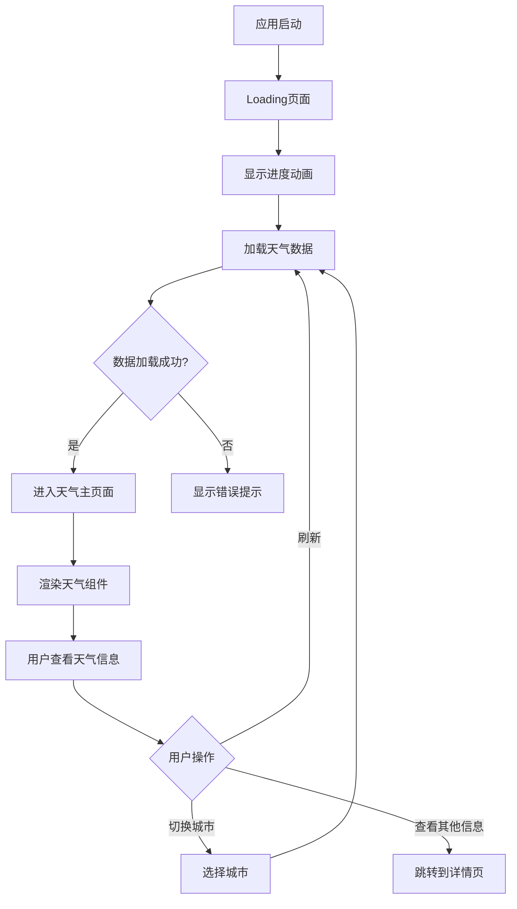

```mermaid
graph TD
    A[应用启动] --> B[Loading页面]
    B --> C[显示进度动画]
    C --> D[加载天气数据]
    D --> E{数据加载成功?}
    E -->|是| F[进入天气主页面]
    E -->|否| G[显示错误提示]
    F --> H[渲染天气组件]
    H --> I[用户查看天气信息]
    I --> J{用户操作}
    J -->|刷新| D
    J -->|切换城市| K[选择城市]
    K --> D
    J -->|查看其他信息| L[跳转到详情页]
```