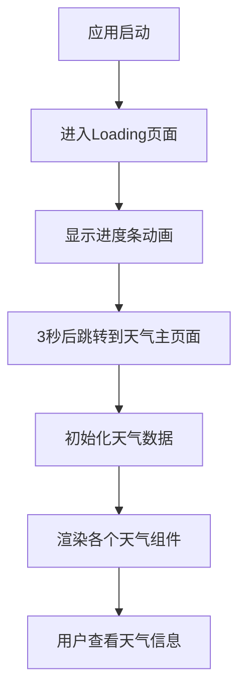
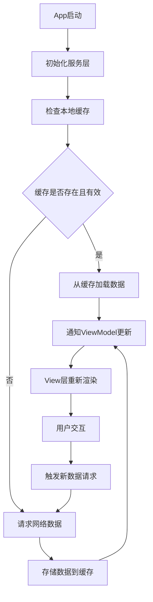
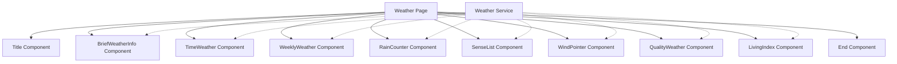
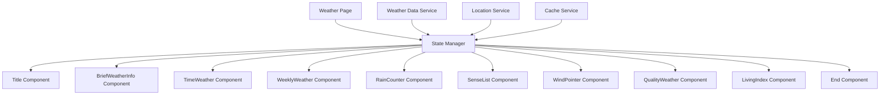

# 天气应用改进设计方案

## 当前架构分析

### 现有组件结构
1. **title组件** - 显示标题和城市名称
2. **briefWeatherInfo组件** - 展示当前天气概况
3. **timeWeather组件** - 展示逐小时天气预报
4. **weeklyWeather组件** - 展示一周天气预报
5. **rainCounter组件** - 展示降雨概率和云量
6. **senseList组件** - 展示湿度、体感等环境数据
7. **WindPointer组件** - 展示风向风力信息
8. **qualityWeather组件** - 展示空气质量信息
9. **livingIndex组件** - 展示生活指数建议
10. **end组件** - 展示页面底部信息

### 当前存在的问题
1. 组件间耦合度高，难以单独维护
2. 数据直接硬编码在组件中，不利于扩展
3. 缺乏统一的状态管理和数据流控制
4. UI设计较为简单，交互体验有待提升

## 改进设计方案

### 1. 架构优化

#### MVVM架构模式引入
```
View Layer (HML/CSS) <- ViewModel (JS) <- Model (Service/Data)
```

#### 数据管理层设计
- 创建 WeatherDataService 统一管理天气数据
- 实现本地缓存机制，减少网络请求
- 添加数据订阅/发布机制

#### 组件通信优化
- 使用全局状态管理替代层层传递props
- 实现组件间事件总线机制

### 2. UI/UX改进

#### 响应式布局设计
- 适配手机、平板等多种设备屏幕
- 使用弹性布局和相对单位

#### 视觉风格统一
- 建立色彩体系和字体规范
- 统一组件样式和交互反馈

#### 交互动效增强
- 添加页面切换动画
- 实现数据加载状态反馈

### 3. 性能优化

#### 懒加载机制
- 按需加载非首屏组件
- 实现组件预加载策略

#### 列表渲染优化
- 对长列表使用虚拟滚动技术
- 添加骨架屏提升加载体验

#### 缓存策略
- 实现LRU缓存算法
- 添加数据过期机制

### 4. 功能扩展

#### 城市管理功能
- 支持多城市添加和切换
- 实现城市搜索和定位

#### 天气预警系统
- 添加极端天气预警推送
- 实现预警信息展示界面

#### 个性化设置
- 支持温度单位切换（摄氏度/华氏度）
- 提供主题颜色选择

## 流程图

### 当前应用启动流程


### 改进后数据流架构


### 组件关系图


### 改进后组件关系图


## 技术实现要点

### 1. 状态管理实现
```javascript
// 创建全局状态管理器
class WeatherStateManager {
  constructor() {
    this.state = {};
    this.listeners = [];
  }
  
  setState(newState) {
    this.state = {...this.state, ...newState};
    this.notifyListeners();
  }
  
  getState() {
    return this.state;
  }
  
  subscribe(listener) {
    this.listeners.push(listener);
  }
  
  notifyListeners() {
    this.listeners.forEach(listener => listener(this.state));
  }
}
```

### 2. 数据服务实现
```javascript
// 天气数据服务
class WeatherDataService {
  async fetchWeatherData(city) {
    // 先检查缓存
    const cached = this.getCachedData(city);
    if (cached && !this.isExpired(cached.timestamp)) {
      return cached.data;
    }
    
    // 请求网络数据
    const data = await this.requestWeatherData(city);
    
    // 存储到缓存
    this.cacheData(city, data);
    
    return data;
  }
}
```

### 3. 组件通信优化
```javascript
// 使用事件总线
class EventBus {
  constructor() {
    this.events = {};
  }
  
  on(event, callback) {
    if (!this.events[event]) {
      this.events[event] = [];
    }
    this.events[event].push(callback);
  }
  
  emit(event, data) {
    if (this.events[event]) {
      this.events[event].forEach(callback => callback(data));
    }
  }
}
```

## 预期收益

1. **可维护性提升** - 组件解耦，便于单独维护和测试
2. **性能优化** - 减少重复请求，优化渲染性能
3. **用户体验改善** - 响应更快，交互更流畅
4. **扩展性强** - 易于添加新功能和组件
5. **代码复用率提高** - 通用服务和组件可跨页面使用