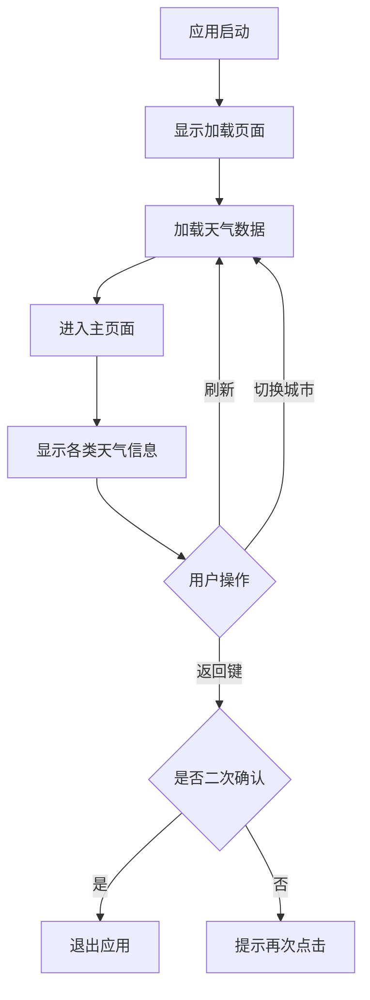

# 简单易实现的改进方案

根据对代码的分析，我为您整理了一些简单易实现的改进点，不需要复杂的技术或架构改动。

## 1. 界面优化改进

### 统一卡片样式
目前各个组件的背景样式相似但不完全一致，可以统一设置：
```css
.weather-card {
    border-radius: 20px;
    background-color: rgba(200, 200, 200, 0.5);
    backdrop-filter: blur(4px);
    margin: 2% 5%;
}
```

### 优化文字显示
- 统一文字颜色和大小
- 添加适当的阴影效果提升可读性
- 增加文字间距改善阅读体验

## 2. 数据展示优化

### 修复senseList组件显示问题
在`senseList.hml`中，体感温度显示的是整个数组，应该显示具体数值：
```html
<!-- 当前代码 -->
<text>{{otherData.clouds_count}}</text>

<!-- 建议修改为 -->
<text>{{otherData.clouds_count[0]}}%</text>
```

### 完善rainCounter组件显示
在`rainCounter.js`中，所有云量情况都使用同一张图片，可以添加不同云量的图片：
```javascript
if (cloudCount >= 67) {
    this.clouds = "/common/img/多云.png";
} else if (cloudCount >= 33) {
    this.clouds = "/common/img/少云.png";
} else if (cloudCount > 0) {
    this.clouds = "/common/img/晴.png";
} else {
    this.clouds = "/common/img/晴.png";
}
```

## 3. 交互体验优化

### 改进返回按钮体验
在`weather.js`中，可以调整双击返回的时间间隔：
```javascript
// 当前是3秒，可以调整为更合适的1.5秒
const BACK_PRESS_INTERVAL = 1500;

if (flag > BACK_PRESS_INTERVAL) {
    this.preTime = -1;
    return true;
}
```

### 优化加载页面
在`loading.js`中，可以调整加载速度让用户体验更流畅：
```javascript
// 当前间隔是30ms，可以调整为更平滑的50ms
let intervalId = setInterval(()=>{
    if(this.timeout < 100){
        this.timeout += 1;
    } else {
        clearInterval(intervalId);
        this.navigateToPage();
    }
}, 50); // 从30改为50
```

## 4. 代码质量改进

### 添加错误处理
在各个组件的onChange方法中添加基本的错误处理：
```javascript
onChange() {
    try {
        // 原有代码
    } catch (error) {
        console.error("数据处理出错:", error);
    }
}
```

### 统一注释风格
将注释统一为中文，便于团队维护。

## 5. 功能扩展（简单）

### 添加刷新功能
在页面中添加一个刷新按钮，重新加载数据：
```html
<div class="refresh-button" onclick="refreshData">
    <image src="/common/img/refresh.png"></image>
</div>
```

```javascript
refreshData() {
    // 重新初始化数据
    this.onInit();
    // 可以添加一个刷新动画提示用户
}
```

### 添加城市切换功能
在title组件中添加简单的城市切换：
```html
<div class="city-switcher">
    <text onclick="switchToShanghai">上海</text>
    <text onclick="switchToBeijing">北京</text>
    <text onclick="switchToGuangzhou">广州</text>
</div>
```

## 6. 性能优化（简单）

### 减少不必要的数据处理
在组件中避免重复处理相同数据，可以添加判断：
```javascript
onChange() {
    // 如果数据没有变化就不重新处理
    if (JSON.stringify(this.newData) === JSON.stringify(this.oldData)) {
        return;
    }
    // 处理数据的代码...
}
```

## 流程图



## 实施建议

1. **优先级排序**：
   - 首先修复显示问题（如senseList组件）
   - 然后优化界面样式统一性
   - 最后添加新功能

2. **逐步实施**：
   - 每次只修改一个组件
   - 修改后测试确保正常运行
   - 记录修改内容便于回溯

3. **测试验证**：
   - 每个改进点完成后进行简单测试
   - 确保不影响现有功能
   - 在不同设备上验证显示效果

这些改进都比较简单，不需要引入复杂的技术或重构架构，可以快速实施并看到效果。